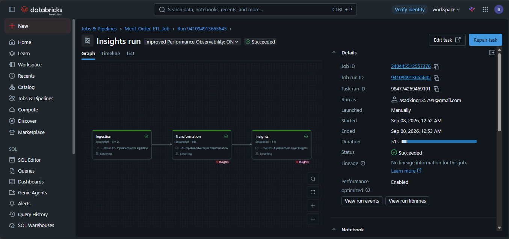
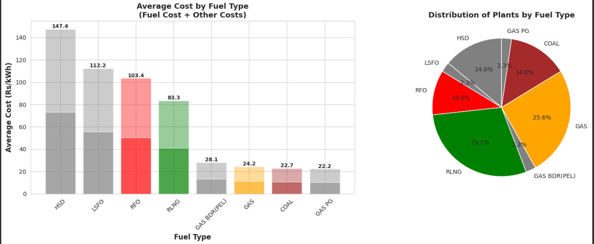
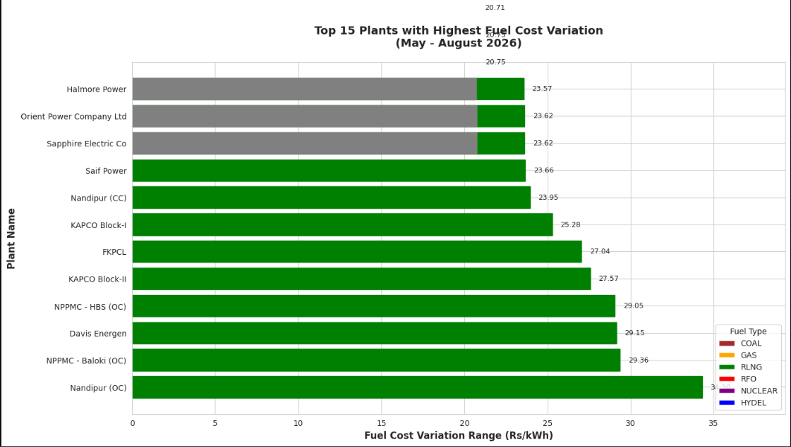
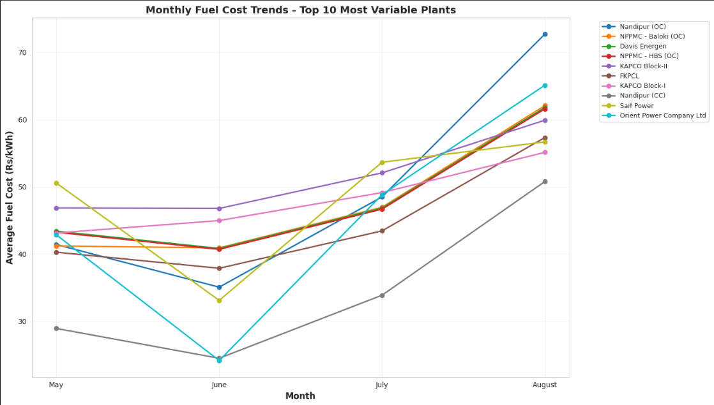
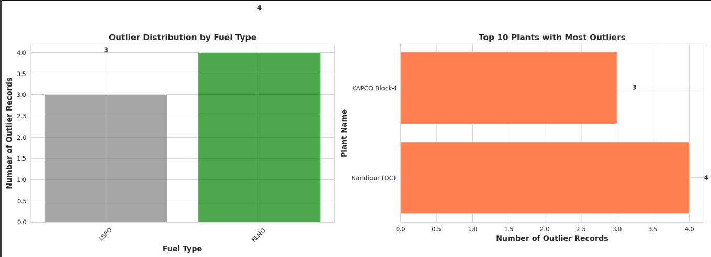

# Merit Order ETL Pipeline

Bronze → Silver → Gold pipeline on Databricks that tracks how plant-wise fuel costs on
Pakistan's power grid moved across May–August 2026, using NTDC's Merit Order / Economic
Merit Order (EMO) reports as the source.

**Author:** Muhammad Asad
**Built for:** Renewables First, Data Engineer technical assessment

## Pipeline overview

| Notebook | Layer | What it does |
|---|---|---|
| `bronze ingestion.ipynb` | Bronze | Discovers and downloads every Merit Order/MO/EMO PDF for May–Aug 2026 into a Unity Catalog Volume, then OCR-parses each PDF's table into `rf_assessment.bronze.merit_order_data` |
| `silver layer transformation.ipynb` | Silver | Runs data quality checks, cleans and standardizes types, computes cost-breakdown percentages, writes `rf_assessment.silver.merit_order_data` |
| `gold layer Insights.ipynb` | Gold | Aggregates plant-wise and fuel-type-wise cost variation, flags outliers, produces the charts and summary tables behind the findings |

Each layer writes a Delta table before the next layer reads it, so any stage can be
re-run independently and the raw PDFs are never touched again after Bronze — if a
transformation rule turns out wrong, it's fixed and re-run against Bronze, not
re-downloaded from NTDC.

## Design decisions

**Ingestion works around the site being a JS-rendered (Angular) app, not a scrapeable
HTML page.** NTDC's merit-order page doesn't expose report links in its raw HTML — the
links only exist inside the compiled Angular JS bundle. Rather than trying to render the
page or guess filenames, the pipeline downloads the bundle directly and regex-extracts
every `/services/meritorder/...pdf` path out of it, then filters down to the target
year/months. This is more reliable than pattern-guessing filenames, since it reads the
exact paths the site itself uses.

**PDF parsing uses Databricks' `ai_parse_document` rather than a plain-Python PDF
library.** The Merit Order reports are scanned/image-based tables, not text-layer PDFs,
so a library like `pdfplumber` can't extract them directly - `ai_parse_document` OCRs
each page and returns structured table elements, which are then parsed with
`pandas.read_html` into the actual 8-column merit order schema (`sr_no`, `plant_name`,
`fuel_type`, `other_cost`, `fuel_cost`, `vom_cost`, `specific_cost`,
`status_last_order`).

**Outlier detection is done per fuel type, not fleet-wide.** RFO, RLNG, and coal plants
sit at structurally different cost levels, so a single IQR threshold across the whole
fleet would flag most RFO plants as "outliers" purely from scale. Gold computes Q1/Q3
and the IQR bounds separately within each `fuel_type_clean` group, so a flagged plant is
actually unusual for its fuel type, not just expensive in absolute terms.

**Silver keeps every report snapshot rather than collapsing straight to one row per
plant per month.** NTDC doesn't publish once a month - the "Merit Order" is revised
several times (as an "EMO") whenever fuel prices are updated, giving roughly 6-7 report
files per month rather than one. Silver preserves every snapshot (one row per
plant/report file); Gold does the monthly aggregation on top of that, which keeps the
underlying data auditable back to a specific report date rather than baking an averaging
assumption into Silver where it can't be revisited later.

## Assumptions made

- **The Angular bundle's filename is a point-in-time snapshot.** It's referenced by its
  build hash, which changes whenever NTDC redeploys the site. If ingestion is re-run
  after a redeploy, the bundle URL will need to be re-discovered from the site's current
  `index.html` rather than reused as-is.
- **A table with exactly 8 columns, once OCR'd, is the merit order table.** Some report
  PDFs contain a small reference/notes table in addition to the main merit order table;
  column count is used to distinguish them. This is a pragmatic heuristic under the
  assessment deadline, not a guarantee - it assumes no other table in any report happens
  to also have 8 columns.
- **`specific_cost` is the total unit cost**, and `fuel_cost` / `vom_cost` / `other_cost`
  are its components - the cost-breakdown percentages in Silver are calculated on that
  basis.
- **Cost figures across all report files are already in the same unit** (PKR/kWh) and
  don't require conversion - no unit inconsistency was found across the parsed reports,
  but this wasn't independently verified against a second source.

## Data quality issues encountered, and how they were handled

| Issue | Where caught | Handling |
|---|---|---|
| Inconsistent filename dates: some reports use a 2-digit year (`EMO 19-04-26.pdf`), others 4-digit (`EMO 23-04-2026.pdf`) | Bronze, date extraction | Regex parses the date out of the filename; rows where extraction fails are logged rather than silently included with a blank date |
| Inconsistent month-folder naming on the source site (full month names vs. 3-letter abbreviations) | Bronze, discovery | The actual folder string found in the JS bundle path is used as-is for the download URL, rather than assuming one fixed format |
| Multiple report revisions per month (original Merit Order + several EMOs) | Silver / Gold | Every snapshot is kept as its own row rather than deduplicated away; monthly aggregation happens explicitly in Gold, where the choice of "average across revisions" vs. "latest revision in the month" is a visible, deliberate step |
| Missing/non-numeric cost values (e.g. `-` used for zero-cost fuel types like hydro) | Silver | Cleaned to `0.0` explicitly rather than dropped, since a `-` here means "no fuel cost applies," not "unknown" |
| Possible duplicate rows | Silver | Checked on the full set of key fields (plant, date, file, fuel type, all four cost columns) rather than plant+date alone, since the same plant legitimately appears more than once per report if it runs on more than one fuel type |
| Negative cost values | Silver | Explicitly checked for and flagged (none were found in this run, but the check runs every time rather than assuming it's unnecessary) |
| Year/month columns disagreeing with the parsed `effective_date` | Silver | Cross-validated against each other as a consistency check, to catch a bad date parse before it reaches the analysis layer |

## Gold Layer — insights & analysis

The pipeline runs as a single Databricks Job (`Merit_Order_ETL_Job`) with three
chained tasks — Ingestion → Transformation → Insights — so Gold is always built from a
fresh Bronze/Silver run rather than a manually-triggered notebook:

The `Insights` task is where the four Gold analyses below are computed and saved as
their own Delta tables (`gold.plant_cost_variation`, `gold.monthly_plant_costs`,
`gold.cost_outliers`, `gold.fuel_type_monthly_analysis`, `gold.fuel_type_summary`), so
any of these can be queried directly rather than only viewed as a chart.

### 1. Fuel type is the first-order driver of cost, and of who runs at all

HSD (diesel) and LSFO plants sit far above everything else — **Rs 147.4/kWh and
Rs 112.2/kWh** respectively — roughly 4-6x the cost of RLNG (Rs 83.3) and 5-6x coal or
piped gas (Rs 22-24/kWh). The pie chart explains why that matters: HSD and LSFO plants
are a small slice of the fleet (14.0% and 2.3% of plants), while the cheap end — RLNG
(29.1%) and GAS (25.6%) — makes up more than half of all plants. This is the merit order
working as designed: the cheapest fuels carry most of the base load, and the expensive
diesel/furnace-oil plants exist mainly as the last-resort capacity dispatched when
cheaper supply runs out. It also sets up the next chart — being *expensive* and being
*volatile* turn out to be two different plants.

### 2. RLNG plants — not the most expensive fuel — show the most month-to-month swing

Almost every plant on this top-15 list runs on RLNG, despite RLNG sitting mid-pack on
average cost (Rs 83.3/kWh vs. HSD's Rs 147.4). **Nandipur (OC)** has the widest swing
(~Rs 34/kWh between its cheapest and most expensive month), followed by **NPPMC -
Baloki (OC)**, **Davis Energen**, and **NPPMC - HBS (OC)** all in the high Rs 20s. The
takeaway for a non-technical reader: HSD/LSFO plants are consistently expensive, but
RLNG plants are where the price *risk* actually lives — which matters more for budgeting
than the average cost alone would suggest, since a volatile input is harder to plan
around than a stable-but-pricey one.

### 3. The cost run-up is concentrated in July–August, not spread evenly across the period

Nearly every one of the top-10 most variable plants follows the same shape: a small dip
from May to June, then a steep climb from June through August. **Nandipur (OC)** more
than doubles (~Rs 35/kWh in June to ~Rs 73/kWh in August); **Orient Power Company**
roughly triples over the same window (~Rs 25 to ~Rs 65/kWh). Because this pattern shows
up across plants with different owners and (mostly) the same fuel type at the same time,
it points to a shared external cost shock hitting RLNG-fired generation in that window —
consistent with the fossil-fuel supply disruption referenced in the assessment brief —
rather than anything plant-specific.

### 4. Outliers cluster on one plant, not one bad month

Running IQR outlier detection separately within each fuel type (see *Design decisions*
above) flagged 7 outlier readings total — 4 RLNG, 3 LSFO. What stands out is *where*
they cluster: **Nandipur (OC)** alone accounts for 4 of the 7 flagged readings, with
**KAPCO Block-I** responsible for 3. Combined with chart 2 and 3, this reframes Nandipur
(OC) from "one plant among several with high variation" to the single plant that most
consistently deviated from its own fuel type's normal cost range across multiple report
snapshots — the strongest single candidate for a plant-specific line item in the
findings, rather than pure market-wide fuel cost movement.

## Known gaps / next steps

- Outlier and variation figures are only as good as the OCR extraction - a misread digit
  in a scanned table would currently pass through as a valid number rather than being
  flagged; a sanity-range check per fuel type (e.g. an implausible Rs/kWh value) would
  catch this and is a natural next addition.
- The Angular bundle URL should be discovered dynamically from the site's current HTML
  rather than hardcoded, so re-running ingestion after a site redeploy doesn't require a
  manual update.
